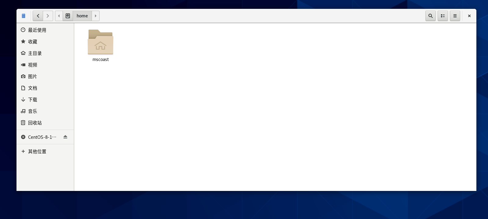

hi hi,我来学Linux啦！

课程：尚硅谷Linux零基础教程

链接：https://www.bilibili.com/video/BV19W4y1w7cM/?spm_id_from=333.337.search-card.all.click&vd_source=5fe9c94a65e8441f3b23196d1615cc4c

# 课程框架
1. 部署系统：
VM虚拟机-学习快速搭建Centos，Ubuntu多种系列阿里云ECS-企业应用实践

2. 命令操作：
系统服务管理，用户权限管理，文件系统管理，VIM编辑器，文件搜索，压缩解压，硬件资源管控

3. 拓展方向：两个方向：java后端，大数据开发。对应要求的技能也不一样。

# 1. Linux入门
## 1.1 Linux是什么？
Linux是操作系统。操作系统，也就是我们经常使用的MacOS，Windows，ios，安卓的统称。它们和Linux都属于操作系统。

Linux，全称GNU/Linux，其内核由林纳斯·本纳第克特·托瓦兹在赫尔辛基大学上学时出于个人爱好而编写的操作系统内核，于1991年10月5日首次发布，它主要受到Minix和Unix思想的启发，是一套免费使用和自由传播的类Unix操作系统，它是一个基于POSIX的多用户、多任务、支持多线程和多CPU的操作系统。它能运行主要的Unix工具软件、应用程序和网络协议。它支持32位和64位硬件。Linux继承了Unix以网络为核心的设计思想，是一个性能稳定的多用户网络操作系统。

## 1.2 Linux的历史
- 1946年2月14日在美国宾夕法尼亚大学诞生人类第一台计算机，用了18000个电子管，占地170平方米，重达30吨，耗电功率约150千瓦，每秒钟可进行高达5000次运算！！美国国防部用它来进行弹道计算！！

这里就可以看出来，早期计算机的性能和如今的设备相比，简直是云泥之别。因为现在使用的手机，电子管就有100亿个，每秒计算都以亿计量。

- 1969年，Ken Thompson(C语言之父)利用汇编语言(B语言)开发了File Server System(Unics，即UNIX 的原型)

这里是计算机的第一次进化，从以前只能用于数学计算，到可以存储文件，操作文件。

- 1972-1973年，Dennis Ritchie和KenThompson发明了C语言，随后二人使用c语言重写UNIX 的内核。

学过c语言的都知道，c语言已经是一门非常强大的语言了，有很多快捷完善的语法。而到此，人类正式实现了人机交互。也就是，面对人类的需求，程序员可以翻译成电脑的指令，让电脑完成需求。从而计算机的功能得到极大提升。

但是使用计算机的前提还是掌握C语言，也就是只有C语言专业的IT工程师，才能使用当时的计算机。也就是说不够大众化。

- 1983年11月10日，为向IBM公司研发的计算机提供图形用户界面和多任务环境的操作系统，微软公司在纽约广场酒店宣布开发Microsoft Windows；同月，微软公司CEO比尔·盖茨向IBM展示了Windows的测试版本，命名为“界面管理器”(后经过营销专家罗兰·汉森的建议改为现名)

大神比尔盖茨开始向大众化方向进行开发，创造了Windows操作系统。

- 1985年11月20日，在宣布开发Windows两年后，微软公司正式发布Windows1.0，硬件要求极高！！！最低256KB内存、两个双面软盘驱动器和一个图形适配卡。

- 1990年5月22日，Windows3.0正式发布，改善了系统外观，增加了虚拟内存和VxD功能及程序管理器、文件管理器和打印管理器，在首销的六个月中便卖出了200多万份。

装有Windows操作系统的的计算机已经普及。

- 1991年，芬兰赫尔辛基大学的研究生Linus Torvalds基于gcc、bash开发了针对386机器的Linux内核。(开源的)

既然成熟的Windows操作系统在1990年已经普及，那么为什么linus大神还要开发Linux操作系统呢？原因有两点：

> 1. 商业化的Windows需要收费，面向企业可以负担。但是面对普通的IT程序员的学习需求， 负担就很大。
> 2. Windows操作系统并不底层，不利于程序员学习计算机内核。
 
可以说，Linux的开源，造福了后继无数程序员。

- 1994 年，Torvalds 发布 Linux-v1.0。

- 1996年，Torvalds发布 Linux-v2.0，确定了Linux的吉祥物：企鹅(@腾讯)

- 1997年经过许多失败的项目后，苹果推出新操作系统一一Mac OS的测试版，而后推出的正式版取得了巨大的成功。

## 1.3 Linux的特点
### 一切皆文件
整个操作系统，包括于硬件的交互，和系统的交互，都最终由一个二进制文件完成，都指向一些二进制文件。

不仅仅如此，Linux的文件有别于其他操作系统的文件，通过后缀比如.mp3，.exe这样，Linux中都是一种文件，所以没有加上后缀的意义。有时候会有.cont结尾的文件，这只是一种标记。

### 开源免费
伟大，无需多言。
### 兼容POSIX.O
简单来说，就是早期Linux刚刚开发出来时，用户比较关系的是能不能兼容Windows的软件程序。

### 优秀的图形化界面
虽然Linux主要用命令行进行操作，但是Linux同样也可以配置美观的图形化界面。

### 多用户与多任务
Linux多用于企业服务器，而这代表常常需要多用户使用同一个服务器。各各用户有不同的权限，互不影响。多任务就是可以让多个项目独立运行。

### 多平台支持
Linux作为一个嵌入式操作系统，不仅仅支持计算机，游戏机，机顶盒，掌机都能支持。

### 安全性
Linux相比于其他操作系统，安全性更好。不像Windows早期经常被黑客攻击。
## 总的来说
和常用的Windows操作系统相比较，Linux更加底层，使用门槛更高，但是更泛用，可定制性更强。

## 1.4 Linux常见版本
Linus最初写的Linux只是一个内核，后续通过不同的开发者不断完善，发展出了各种不同版本的稳定的操作系统。所以我们常说的Linux只是一个统称，要使用还得聚焦到具体版本上。

# 2. Linux虚拟机的安装部署
操作系统是安装到计算机上的，但是去下单一台新电脑，然后装一个Linux系统去学习成本太高。我们倾向于在常规Windows系统上模拟一台新的计算机，然后在这台虚拟机上安装Linux。所使用的软件为VMware。

为什么可以这样？因为我们的计算机之所以是计算机，是因为它拥有构成计算机必要的组件，比如CPU，内存，磁盘。只是我们当前在这之上安装的是Windows操作系统。所以理论上模拟新的计算机是可以实现的。

## 2.1 安装VMware
第一步，也是计算机安装虚拟机的前提条件：
打开任务管理器的性能界面：

看CPU的虚拟化是否启用。

如果没有开启，则需要进入BlOS系统，将VirtualizationTechnology改为Enalble，不同品牌的电脑进入BIOS的方式都不同，可以根据电脑品牌型号搜索对应的进入方式。

然后就可以去下载安装包安装了（最好以管理员身份运行安装包）
## 2.2 安装常见错误
错误1；
关键词：Oxc0000005  windows Hyper-V

在任务管理器的服务页面，管理服务是否开启

错误2；关键词：蓝屏，

下一步，重启电脑

## 2.3 创建虚拟机
这些东西深究又会扯到操作系统啊，网络啊上面去，就暂时不管了。

创建教程：
https://www.bilibili.com/video/BV19W4y1w7cM?spm_id_from=333.788.player.switch&vd_source=5fe9c94a65e8441f3b23196d1615cc4c&p=8

## 2.4 VMware安装Linux
这其实就相当于在一台新电脑上装操作系统了。我相信现在很多使用计算机的用户也没有安装操作系统的经验。

在早期计算机上，安装操作系统通过在新电脑读取DVD上的信息安装的。以前买电脑是买一个盒子，里面放计算机还有配套的Windows操作系统的DVD（这种复古感太棒了！！）
现在的电脑通常都是用u盘啥的插上去装。

这个虚拟机内部应该还有模拟DVD读取的功能。我要做的就是去网上找DVD中的镜像文件，用虚拟机读取文件安装操作系统。
阿里镜像网站：
HTTPS://DEVELOPER.ALIYUN.COM/MIRROR/
清华大学镜像源网站：
HTTPS://MIRRORS.TUNA.TSINGHUA.EDU.CN/

## 2.5 Linux的部署
版本: CentOS 7 x64
载入DVD镜像文件之后，开机就会自动进入操作系统安装界面了。

配置一些安装信息时很有可能会遇到一大堆看不懂的东西。然后经常就是对着一大堆名词一个一个搜，然后去找配置文件。搞半天搞不定，最后全部抄别人的配置才装好。

进入操作页面，最主要是留意一个东西，root用户的密码。所谓root，就是这个操作系统的最大权限拥有者。可以说在这个操作系统，root就是上帝。所以，记住root的密码。

## 2.6 Linux的目录结构
通过图形化界面，Linux系统已经基本上可以满足个人用户的使用了。然而，作为it程序员还需要更加深入地学习。

在Linux操作系统中一切皆文件，最根源最底层的文件是根目录。
而在Windows中，对应的是某某盘。

### /home
记不记得之前说过，Linux是支持多用户的。用户可以在文件管理器中找到一个标有房子标记的文件夹，同时里面文件夹名与当前用户的用户名一样。这个文件夹称为home 家目录。

它就相当于此用户在本系统买的房子，拥有家目录的管理权限，也可以在家目录存放东西。

### /bin
本文件夹的名称来源于英文“二进制”binary。
此文件夹是用来存放基础脚本命令的。早期计算机命令还是用二进制写的，所以此文件夹被命名为“bin”。现在虽然里面的命令不再是二进制书写，但是这个命名习惯被保留了下来。

### /sbin 
bin的表兄，s来源于super user，存放更高级的命令。

### /boot
存放Linux内核的相关配置。一切皆文件，Linux系统的实现也是建立在配置文件之上。

### /dev
来源于词汇“device” 设备，器材。所有的设备，比如CPU，磁盘，都在里面有相关文件。

### /etc
意思是环境变量。用来存放设置文件。用户通过修改里面对应文件，实现修改设置。

在Windows的图形化界面中，我们只需要打开“齿轮图标”，就可以修改设置。

### /lib and /lib64
/lib 文件夹是 库文件目录 ，包含了所有对系统有用的库文件。简单来说，它是应用程序、命令或进程正确执行所需要的文件。在 /bin 或 /sbin 目录中的命令的动态库文件正是在此目录中。内核模块同样也在这里。--来源网络

### /media and /mnt
这两个也是用来存放设备文件的文件夹。

/media用来存放鼠标，键盘，音响这些设备。

/mnt单独指磁盘挂载和硬盘。

### /opt
用来存放用户安装的软件。

### /proc
内存映射。好像是把内存空间映射到这上面。

### /run and /srv
当系统部署了向外公布的服务时，会在里面产生一些文件。

### /sys
来源于“system”，系统。其中文件与上面介绍的文件有一定重复。用来存放Linux系统不断更新产生的一些多的文件。

### /tmp
临时文件，会定期清除。如果安装有一些电脑管家的软件，里面的清理垃圾的功能，优先就会清理这里面的文件。

### /usr
存放用户的个性化设置。因为支持多用户，所以需要保留不同用户的设置。

### /var
额外产生的日志的文件。

### root
属于root用户的家目录。但是放在根目录下。

## 小结
一般来说，最常用的就是存放软件的/opt文件，和/home家目录（root用户也有家目录，存在根目录下，但是一般不用root的家目录）。然后使用的过程中，会在/run, /srv, /tmp, /var, /usr 这些目录下产生文件。

然后偶尔用到的文件，比如修改设置时会用到/etc，自定义一些命令需要存在/bin or /sbin，新增了一些设备比如音响鼠标啥的，会使用/media和/mnt。

剩下的一些/boot, /dev, /lib, /lib64, /sys /proc这些系统需要的文件就不建议随便修改。有一个命令，叫rm -rf，就可以把这些系统文件通通删除，让操作系统直接挂掉。（前提是有这个权限）

### 如何登录root账号
首先注销当前的账号，以回到登录界面。

在登录界面选择未列出：

输入用户名：root

密码：

这样就完成了。

可以看到，root文件出现了小房子标记。
## 2.7 虚拟机网络设置
虚拟机的网络的ip默认随机分配，不利于外部访问。所以需要修改。因为网络我还没有系统性学习，这里就不深究这些操作。

教程：
https://www.bilibili.com/video/BV19W4y1w7cM/?p=11&spm_id_from=333.1007.top_right_bar_window_history.content.click&vd_source=5fe9c94a65e8441f3b23196d1615cc4c

## 2.8 VMware虚拟机的快照功能
类似于git的版本控制，和艾克的大招。

使用快照功能就相当于在当前的时间点上保存计算机的一切状态。

虚拟机用户拥有将计算机恢复到指定快照上保存的状态。

这个功能在VMware的上面的工具栏可以找到。

一个拍摄快照的方法：

## 2.9 使用VM虚拟机克隆搭建集群
许多领域比如Java，大数据都要模拟计算机集群进行操作。而每一个虚拟机都从安装操作系统开始，就太麻烦了。

克隆这个操作本身没什么可说的，关键就是理解所谓克隆，就是对克隆对象的完全拷贝，也就是说什么ip地址啊，设置之类的完全去被克隆的一模一样。这就会带来一些问题。

所以我们需要学会修改系统中的这些冲突项目。

ip地址就手动改一下就好了。

# 远程工具的使用
公司服务器一般放在机房中，而且没有显示屏，更不用说交互页面。所以要通过远程连接工具连接到Linux服务器进行操作。

## 使用Xshell远程连接服务器
公司服务器一般放在机房中，而且没有显示屏，更不用说交互页面。 所以要通过远程连接工具连接到Linux服务器进行作。

我们选择学习的远程连接工具是Xshell。是一款经典的远程连接工具（但是似乎有一些非常恶心的地方）。安装注册之后，进入Xshell的页面。

第一个目的是要连接上我们的虚拟机。我们可以选择Xshell的新建会话功能<插入图片>，然后输入我们虚拟机的ip地址<插入图片>，然后输入要连接服务器的一个账号的用户名和密码。我们可以直接连接root账号，这样权限更大。

输入账号密码过后，Xshell会申请保存“指纹”，这个东西类似于秘钥，之后再连接此服务器就不用输入这些东西了。

然后在会话的属性页面，可以改这个命令行的外观，我比较喜欢这样的<插入图片>。

噢，当然，使用Xshell连接服务器的话，操作系统就没有图形化界面了，只能命令行操作了。

Xshell可以选择安装一个插件，叫Xftp，和Xshell同属于一个开发商。安装Xftp插件后，就可以向服务器传输文件了。这个页面可以在Xshell中找到。（也可以单独打开Xftp，但是就不会自动连接到Xshell的当前会话）

## 国产远程连接工具finalshell
功能更强大，没有Xshell底层和简洁。我个人更喜欢Xshell。

# 3. Linux命令
## 基本
Linux中这两个文件被隐藏：

. 指当前目录

.. 指上一级目录

文件路径使用左斜杠'/'
## 3.1 帮助类命令
为什么要学习帮助类命令。Linux的命令是非常的多的，再加上命令还可以加各种参数，全部记下来就和背新华字典差不多。所以学习帮助类命令就相当于学习查字典。

### *man*
Linux中的辣个男人，全知的eye。任何命令，在前面加上man修饰，日志就会显示这个命令的一切信息。

### *help*
古老的帮助类命令，很多新增的命令都无法显示。功能相比于man非常孱弱，不建议使用。使用方法也是作为命令前缀。

不过在现代网络信息如此丰富的如今，不管是使用man还是help，可能都不如百度一下来得实在。

这里老师推荐了一个更加强大的工具：uTools。
它不但功能性比那个男人更强，而且更加“亲民”。因为作为软件它可以在命令行之外使用。它本身是不内置数据库的，你可以根据自己的需求安装不同的语法库。所以我们可以安装更加本地化的数据库，这样也可以通过中文搜索。

## 3.2 开关机命令
Linux系统作为服务器，是很少，甚至基本不关机的。特别是大型的项目，每时每刻都有大量的远程连接在服务器上。比如看B站，打英雄联盟啥的都会连接到公司的服务器上，如果服务器关机，显然会造成不可估量的影响。

所以Linux作为服务器正常情况是24小时运行不关机不重启的。网络游戏更新时，公司会发关服公告通知玩家，这侧面说明了一般情况服务器是不关机的。

### *sync*
将内存信息存入硬盘

### *poweroff*
关闭系统

### *reboot*
重启

### *shutdown [选项] 参数*

#### 选项
-  -h 
halt，关机

-  -r
reboot，重启

#### 参数

- now
立刻
- [时间]
等待对应分钟

注：一般没有root权限的普通用户是没有权限关机重启的。

## 3.3 服务管理类命令

## CentOS 6
### *service [服务名] start 开启服务*
### *service [服务名] stop 关闭服务*
### *service [服务名] restart 重启服务*
### *service [服务名] status 查看服务状态*
## CentOS 7
### *systemctl start [服务名] 开启服务*
### *systemctl stop [服务名] 关闭服务*
### *systemctl restart [服务名] 重启服务*
### *systemctl status [服务名] 查看服务*
### *systemctl --type service 查看正在运行的服务*

注：CentOS 6的命令给人一种主宾谓的感觉，所以在CentOS 7中重新写了一个脚本systemctl 改成了主谓宾。

这些服务的开关只会在这次运行生效。系统重新启动过后，所有服务都会回归默认状态。这样一来，有些服务你希望一直延续下去就要每次重新输入。

所幸的是，这些默认的设置是可以进行修改的，你可以自己修改使得每次系统启动成你想要的样子。

## CentOS 6
### *chkconfig 查看所有服务自启配置*
### *chkconfig [服务名] off 关闭服务自启动*
### *chkconfig [服务名] on 开启服务自启动*
### *chkconfig [服务名] --list 查看服务开机启动状态*
## CentOS 7
### *systemctl enable [服务名] 打开自启动*
### *systemctl disable [服务名] 关闭自启动*
### *systemctl is-enabled [服务名] 查看服务是否自启动*
### *systemctl list-unit-files 查看所有服务自启动配置*

记：CentOS 7的命令的确比6好用一些。

## 实操：

因为虚拟机的挂起功能可能导致网络时间与虚拟机时间冲突，所以可以关闭“网路管理器”服务与其自启动，避免这样的问题。

注：关闭网络管理器就不会自动配置网络，会导致Xshell连不上。

还有防火墙会导致以后远程连接出现问题，也可以关闭。

注：firewalld -- 防火墙

NetworkManager -- 网络管理器

### Linux系统有7种运行级别(runlevel)：常用的是级别3和5(CentOS7中只有两个级别了：3和5)

- 运行级别0：系统停机状态，系统默认运行级别不能设为0，否则不能正常启动

- 运行级别1：单用户工作状态，root权限，用于系统维护，禁止远程登陆
- 运行级别2：多用户状态(没有NFS)，不支持网络
- 运行级别3：完全的多用户状态（有NFS），登陆后进入控制台命令行模式
- 运行级别4：系统未使用，保留
- 运行级别5：X11控制台，登陆后进入图形GUI模式
- 运行级别6：系统正常关闭并重启，默认运行级别不能设为6，否则不能正常启动

## 文件目录类命令
在Windows的图形化界面下，文件操作已经很熟悉了。Linux服务器中，我们要学会使用命令行进行文件操作。
### *pwd*
print working directory,打印当前工作目录的绝对路径。也就是打印从根目录到当前目录的路径。有时候不清楚自己到底在哪一个目录时可以使用这个命令。
### *ls*
显示当前目录下的所有文件。不同文件会用颜色区分开来。比如。蓝色的是文件夹，白色的是文件。

ls还有很多选项。太多就不在这里展示了。这个'~'就代指此用户的家目录。

最常使用的查看当前文件的是
### *ll*
实际上它就相当于，ls -l。显示当前目录文件的详细信息。

### *cd*
切换文件。在图形化界面中，在不同文件夹间来回切换只需要左键点一点。而在命令行中就需要cd命令实现。

关于cd命令，需要知道的是。它有两种输入模式：
1. 绝对路径。也就是从根目录开始。即，路径开头为'/'根目录。
2. 相对路径。相对于当前目录的路径。即，以当前目录下的目录以及更下级目录。相当于在pwd的基础上的路径。

cd还有一些特殊的应用。比如cd和"."与".."的结合，还记得"~"吗，它代指家目录也可以与cd结合使用。

- cd . 

没有效果，移动到当前目录。
- cd ..

移动到上一级目录。
- cd

移动到家目录。（对，除了cd什么都没有）

- cd ~

移动到家目录。

除了那个什么都不写的之外，这样利用代指的命令都可以结合路径使用，比如：

cd ~/test

cd ../root

cd ./etc

此外还有两个最特殊的结合：

- cd -

回到上一次使用的目录

- cd -P

跳转到实际物理路径，而非快捷方式路径。也就是，如果有一个文件是一个快捷访问，直接cd 此文件，就会进入到这个快捷方式的目录。但是如果是cd -P 此文件，就会进入这个快捷方式指向的文件目录。

## *mkdir [文件名]*
make directory，创建目录。

比如，mkdir waerdeng。就是在当前目录下创建一个文件“waerdeng”。也可以在文件前加上路径，就可以在这个路径下创建目录。比如刚刚创建了一个“waerdeng”，我这样写，mkdir waerdeng/hu。这样就在目录waerdeng下创建了一个文件“hu”。

但是我希望创建一个目录“yumi”，然后在目录“yumi”下，再创建一个目录“mianfen”。我直接mkdir yumi/mianfen，就不行了，因为这个命令的实际意义是在yumi/路径下创建一个叫“mianfen”的目录，但是“yumi”这个目录本身不存在。

### *mkdir -p*
递归创建目录。总之，使用mkdir -p yumi/mianfen。这样是可以一下子又创建“yumi”又在里面创建“mianfen”的。

## *rmdir [目录名]*
删除指定空目录。可以看出来，这个命令只能删目录，还只能是空目录。功能非常孱弱，以后基本上不会用。