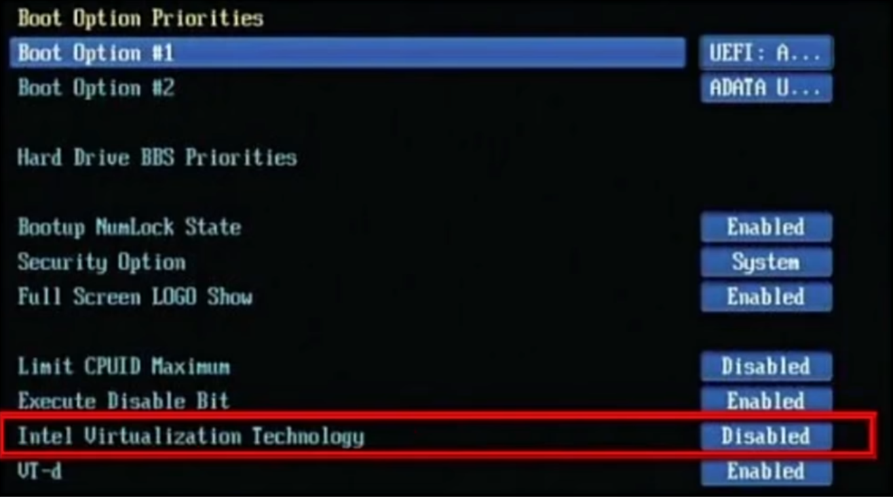

hi hi,我来学Linux啦！

课程：尚硅谷Linux零基础教程

链接：https://www.bilibili.com/video/BV19W4y1w7cM/?spm_id_from=333.337.search-card.all.click&vd_source=5fe9c94a65e8441f3b23196d1615cc4c

# 课程框架
1. 部署系统：
VM虚拟机-学习快速搭建Centos，Ubuntu多种系列阿里云ECS-企业应用实践

2. 命令操作：
系统服务管理，用户权限管理，文件系统管理，VIM编辑器，文件搜索，压缩解压，硬件资源管控

3. 拓展方向：两个方向：java后端，大数据开发。对应要求的技能也不一样。

# 1. Linux入门
## 1.1 Linux是什么？
Linux是操作系统。操作系统，也就是我们经常使用的MacOS，Windows，ios，安卓的统称。它们和Linux都属于操作系统。

Linux，全称GNU/Linux，其内核由林纳斯·本纳第克特·托瓦兹在赫尔辛基大学上学时出于个人爱好而编写的操作系统内核，于1991年10月5日首次发布，它主要受到Minix和Unix思想的启发，是一套免费使用和自由传播的类Unix操作系统，它是一个基于POSIX的多用户、多任务、支持多线程和多CPU的操作系统。它能运行主要的Unix工具软件、应用程序和网络协议。它支持32位和64位硬件。Linux继承了Unix以网络为核心的设计思想，是一个性能稳定的多用户网络操作系统。

## 1.2 Linux的历史
- 1946年2月14日在美国宾夕法尼亚大学诞生人类第一台计算机，用了18000个电子管，占地170平方米，重达30吨，耗电功率约150千瓦，每秒钟可进行高达5000次运算！！美国国防部用它来进行弹道计算！！

这里就可以看出来，早期计算机的性能和如今的设备相比，简直是云泥之别。因为现在使用的手机，电子管就有100亿个，每秒计算都以亿计量。

- 1969年，Ken Thompson(C语言之父)利用汇编语言(B语言)开发了File Server System(Unics，即UNIX 的原型)

这里是计算机的第一次进化，从以前只能用于数学计算，到可以存储文件，操作文件。

- 1972-1973年，Dennis Ritchie和KenThompson发明了C语言，随后二人使用c语言重写UNIX 的内核。

学过c语言的都知道，c语言已经是一门非常强大的语言了，有很多快捷完善的语法。而到此，人类正式实现了人机交互。也就是，面对人类的需求，程序员可以翻译成电脑的指令，让电脑完成需求。从而计算机的功能得到极大提升。

但是使用计算机的前提还是掌握C语言，也就是只有C语言专业的IT工程师，才能使用当时的计算机。也就是说不够大众化。

- 1983年11月10日，为向IBM公司研发的计算机提供图形用户界面和多任务环境的操作系统，微软公司在纽约广场酒店宣布开发Microsoft Windows；同月，微软公司CEO比尔·盖茨向IBM展示了Windows的测试版本，命名为“界面管理器”(后经过营销专家罗兰·汉森的建议改为现名)

大神比尔盖茨开始向大众化方向进行开发，创造了Windows操作系统。

- 1985年11月20日，在宣布开发Windows两年后，微软公司正式发布Windows1.0，硬件要求极高！！！最低256KB内存、两个双面软盘驱动器和一个图形适配卡。

- 1990年5月22日，Windows3.0正式发布，改善了系统外观，增加了虚拟内存和VxD功能及程序管理器、文件管理器和打印管理器，在首销的六个月中便卖出了200多万份。

装有Windows操作系统的的计算机已经普及。

- 1991年，芬兰赫尔辛基大学的研究生Linus Torvalds基于gcc、bash开发了针对386机器的Linux内核。(开源的)

既然成熟的Windows操作系统在1990年已经普及，那么为什么linus大神还要开发Linux操作系统呢？原因有两点：

> 1. 商业化的Windows需要收费，面向企业可以负担。但是面对普通的IT程序员的学习需求， 负担就很大。
> 2. Windows操作系统并不底层，不利于程序员学习计算机内核。
 
可以说，Linux的开源，造福了后继无数程序员。

- 1994 年，Torvalds 发布 Linux-v1.0。

- 1996年，Torvalds发布 Linux-v2.0，确定了Linux的吉祥物：企鹅(@腾讯)

- 1997年经过许多失败的项目后，苹果推出新操作系统一一Mac OS的测试版，而后推出的正式版取得了巨大的成功。

## 1.3 Linux的特点
### 一切皆文件
整个操作系统，包括于硬件的交互，和系统的交互，都最终由一个二进制文件完成，都指向一些二进制文件。

不仅仅如此，Linux的文件有别于其他操作系统的文件，通过后缀比如.mp3，.exe这样，Linux中都是一种文件，所以没有加上后缀的意义。有时候会有.cont结尾的文件，这只是一种标记。

### 开源免费
伟大，无需多言。
### 兼容POSIX.O
简单来说，就是早期Linux刚刚开发出来时，用户比较关系的是能不能兼容Windows的软件程序。

### 优秀的图形化界面
虽然Linux主要用命令行进行操作，但是Linux同样也可以配置美观的图形化界面。

### 多用户与多任务
Linux多用于企业服务器，而这代表常常需要多用户使用同一个服务器。各各用户有不同的权限，互不影响。多任务就是可以让多个项目独立运行。

### 多平台支持
Linux作为一个嵌入式操作系统，不仅仅支持计算机，游戏机，机顶盒，掌机都能支持。

### 安全性
Linux相比于其他操作系统，安全性更好。不像Windows早期经常被黑客攻击。
## 总的来说
和常用的Windows操作系统相比较，Linux更加底层，使用门槛更高，但是更泛用，可定制性更强。

## 1.4 Linux常见版本
Linus最初写的Linux只是一个内核，后续通过不同的开发者不断完善，发展出了各种不同版本的稳定的操作系统。所以我们常说的Linux只是一个统称，要使用还得聚焦到具体版本上。

# 2. Linux虚拟机的安装部署
操作系统是安装到计算机上的，但是去下单一台新电脑，然后装一个Linux系统去学习成本太高。我们倾向于在常规Windows系统上模拟一台新的计算机，然后在这台虚拟机上安装Linux。所使用的软件为VMware。

为什么可以这样？因为我们的计算机之所以是计算机，是因为它拥有构成计算机必要的组件，比如CPU，内存，磁盘。只是我们当前在这之上安装的是Windows操作系统。所以理论上模拟新的计算机是可以实现的。

## 2.1 安装VMware
第一步，也是计算机安装虚拟机的前提条件：
打开任务管理器的性能界面：

看CPU的虚拟化是否启用。

如果没有开启，则需要进入BlOS系统，将VirtualizationTechnology改为Enalble，不同品牌的电脑进入BIOS的方式都不同，可以根据电脑品牌型号搜索对应的进入方式。

然后就可以去下载安装包安装了（最好以管理员身份运行安装包）
## 2.2 安装常见错误
错误1；
关键词：Oxc0000005  windows Hyper-V

在任务管理器的服务页面，管理服务是否开启

错误2；关键词：蓝屏，

下一步，重启电脑

## 2.3  创建虚拟机
这些东西深究又会扯到操作系统啊，网络啊上面去，就暂时不管了。

创建教程：
https://www.bilibili.com/video/BV19W4y1w7cM?spm_id_from=333.788.player.switch&vd_source=5fe9c94a65e8441f3b23196d1615cc4c&p=8

## VMware安装Linux
这其实就相当于在一台新电脑上装操作系统了。我相信现在很多使用计算机的用户也没有安装操作系统的经验。

在早期计算机上，安装操作系统通过在新电脑读取DVD上的信息安装的。以前买电脑是买一个盒子，里面放计算机还有配套的Windows操作系统的DVD（这种复古感太棒了！！）
